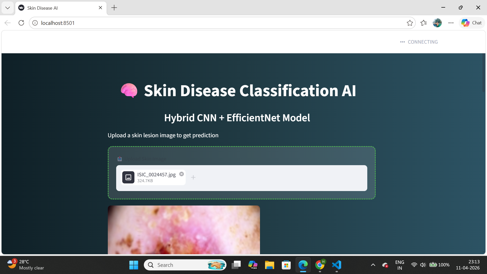
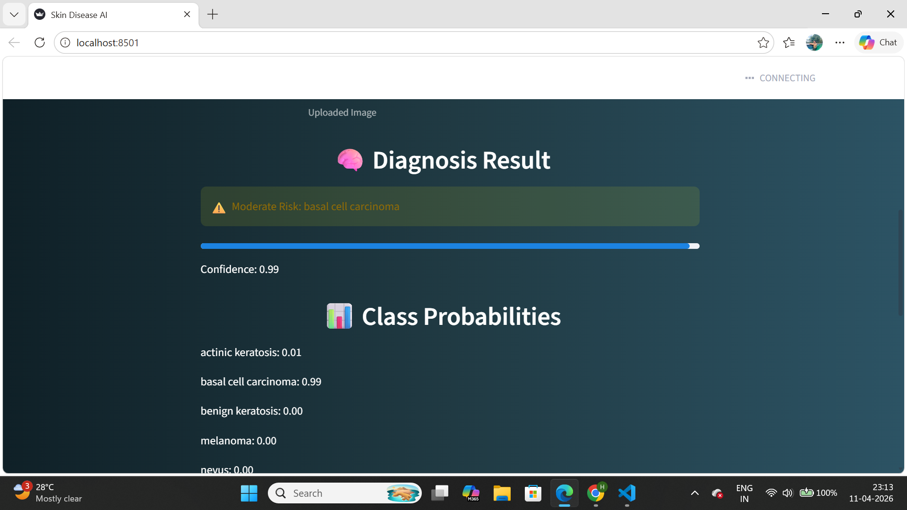
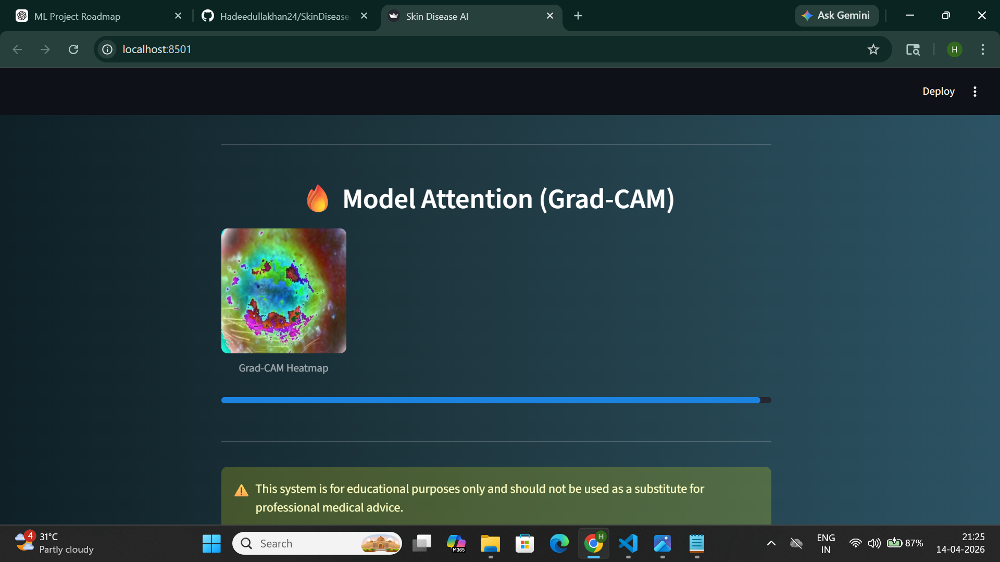

# 🧠 Skin Disease Classification AI

A deep learning-based web application for classifying skin diseases using a **Hybrid CNN + EfficientNet model**, with explainability using Grad-CAM.

---
## 📁 Project Structure

SkinDiseaseAI/
│
├── app/ # Streamlit application
├── models/ # Trained models
├── notebooks/ # Training & experimentation
├── utils/ # Helper functions (Grad-CAM)
├── assets/ # Screenshots
├── README.md
├── requirements.txt
└── .gitignore

---

## 🚀 Features

- 🔍 Classifies skin diseases into 5 categories
- 🧠 Hybrid Deep Learning Model (CNN + EfficientNet)
- 📊 Displays confidence scores and class probabilities
- 🔥 Grad-CAM visualization (model explainability)
- 🌐 Interactive web app built with Streamlit

---
## 💡 Key Highlights

- Hybrid Deep Learning Approach (CNN + EfficientNet)
- Explainable AI using Grad-CAM
- Handles class imbalance using class weights
- Real-time prediction via web interface
- Designed for medical image analysis
---

## 📂 Dataset

This project uses the **HAM10000 dataset**, a widely used dataset for skin lesion classification.

It contains dermatoscopic images of different types of skin diseases.

---

## 🏗️ Project Workflow (Step-by-Step Explanation)

### 🔹 1. Data Preprocessing

- Loaded metadata and image dataset
- Mapped labels from abbreviations to full disease names
- Filtered dataset to **5 selected classes**
- Handled missing values
- Created image paths
- Split dataset into:
  - Training set (70%)
  - Validation set (15%)
  - Test set (15%)

---

### 🔹 2. CNN Model (Baseline Model)

- Built a custom Convolutional Neural Network
- Used layers like:
  - Conv2D
  - MaxPooling
  - Dropout
- Input size: **160 × 160**
- Trained model on training data
- Evaluated using validation data

👉 Purpose:
- Learn basic image features
- Serve as baseline model

---

### 🔹 3. Transfer Learning (EfficientNet)

- Used **EfficientNetB0** pre-trained on ImageNet
- Removed top layer and added custom classification head
- Fine-tuned last layers for better performance
- Used:
  - Data augmentation
  - Class weights (to handle imbalance)

👉 Purpose:
- Capture deep and complex features
- Improve accuracy over CNN

---

### 🔹 4. Model Evaluation

- Evaluated both models on test dataset
- Generated:
  - Accuracy
  - Precision
  - Recall
  - F1-score
- Ensured correct preprocessing for each model:
  - CNN → rescaling (1./255)
  - EfficientNet → preprocess_input

---

### 🔹 5. Hybrid Model (Key Contribution)

- Combined predictions from:
  - CNN model
  - EfficientNet model

- Used average ensembling:

    final_prediction = (cnn_prediction + efficientnet_prediction) / 2

👉 Benefits:
- Improves overall accuracy
- Reduces bias toward majority class
- Produces more stable predictions

---

### 🔹 6. Grad-CAM (Explainability)

- Implemented Grad-CAM to visualize model attention
- Highlights important regions in the image
- Helps understand why the model made a prediction

👉 This adds transparency to the AI system

---

### 🔹 7. Streamlit Web Application

- Built an interactive UI using Streamlit
- Features:
  - Image upload
  - Prediction display
  - Confidence score
  - Class probabilities
  - Grad-CAM heatmap

👉 Makes the model usable in real-world scenarios

---

## 🧪 Classes Used

- Actinic Keratosis
- Basal Cell Carcinoma
- Benign Keratosis
- Melanoma
- Nevus

---

## ⚙️ Installation & Setup

git clone https://github.com/Hadeedullakhan24/SkinDiseaseAI.git  
cd SkinDiseaseAI  
pip install -r requirements.txt  

---

## ▶️ Run the Application

python -m streamlit run app/app.py  

---

## 📸 How to Use

1. Upload a skin lesion image  
2. The model predicts the disease  
3. View:
   - Diagnosis result  
   - Confidence score  
   - Class probabilities  
   - Grad-CAM heatmap  

---
## 📸 Application Preview

### 🔹 Home Screen

### 🔹 Prediction Result

### 🔹 Grad-CAM Visualization

---

## 🌐 Live Demo

Coming soon (Streamlit deployment)

---

## 🧠 Technologies Used

- TensorFlow / Keras  
- EfficientNet  
- OpenCV  
- NumPy / Pandas  
- Scikit-learn  
- Streamlit  

---

## 📌 Future Improvements

- Increase number of classes  
- Improve model accuracy  
- Deploy on cloud (Streamlit Cloud / AWS)  
- Add real-time camera support  

---

## 👨‍💻 Author

Hadeedulla Khan  

---

## 📬 Contact

- GitHub: https://github.com/Hadeedullakhan24
- LinkedIn: https://www.linkedin.com/in/hadeed-ulla-khan-a382a0366

---

## 📜 License

© 2026 Hadeedulla Khan. All rights reserved.